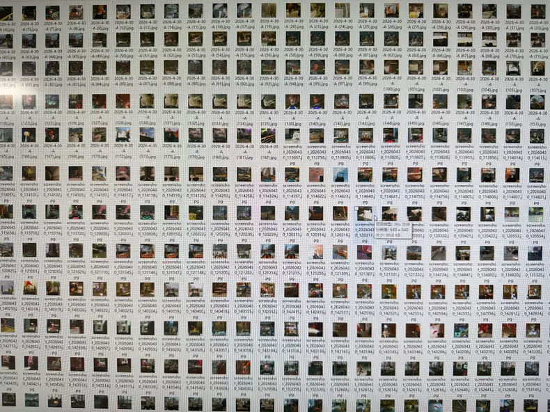
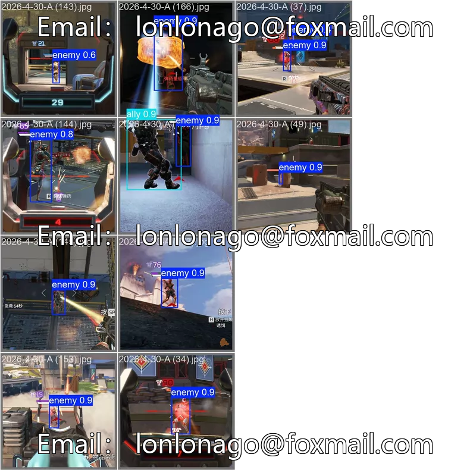
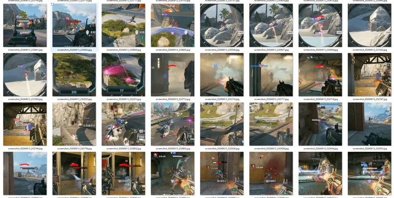

# Apex-legends-yolo-VOC-dataset-
Apex legends yolo VOC dataset 

## Images

## 15000 Apex Legends images

Authentic Collection: All assets are real in-game screenshots captured by myself and manually annotated with precision. No fake augmentation methods such as mirroring or color alteration are used.

High-Quality Annotation: Accurately distinguishes three target categories: Enemy, Ally, and Fallen. Effectively filters out non-target interference in smoke, grenade, and gas environments, essentially avoiding false locks on beacons, gas tanks, railings, foliage, Mirage decoys, etc.

## A model trained on the latest 2026.7 data,It can run on both mobile and PC.  Details are as follows:

Apex Legends July Update Model, in RKNN format, YOLOv8, supporting input sizes of 192 / 256 / 320 / 416 / 640.

【Scope of Application】
This link is for the July model of the same game; compatible with both PC and mobile versions, provided that the software or box supports the current format, YOLO version, and input sizes. Models are not interchangeable between different games.

【Specifications】
Model Format: RKNN
YOLO Version: v8
Input Sizes: 192 / 256 / 320 / 416 / 640
Number of Classes: 4
Training Dataset Size: Approx. 64,000 images
Training Epochs: 1,000

【Class Order】
0 Enemy
1 Ally
2 Downed
3 Negative Sample

【Usage Instructions】
9-output head supports: gb, heino, BlackBox, Edge, Mist, Orange Pi; 6-output head supports: ut, ep, ZhunShen; Single-output head supports: Defier Pro; ZYBox prefers ZIP format.

【Optional Files】
Available sizes and file details:

RKNN ZIP (for ZYBox):
Input sizes: 192 / 256 / 320 / 416 / 640
Contents included:
RKNN model file

## Supporting Tool: 
A custom screenshot utility used personally is also available for sale. It supports customized dataset collection for various shooter games, offering convenient and hassle-free operation.

## Apex Dataset Negative Samples – Effectively Resolves False Lock Issues – 2,100 Images
Nz3
Collected common elements from Season 29 and Outlands maps (beacons, respawn beacons, foliage, railings, capsules, zipline stations, etc.), as well as most character abilities (Exo's aircraft, gas tanks, electric fences, etc.). Incorporating these negative samples into your training set can suppress misidentification.
Usage: Simply add the downloaded images to your training and validation sets according to your preferred ratio (e.g., 7:3 or otherwise), then proceed with training.
Specific Issues Addressed by Negative Samples:
Suppressing False Positives
Without negative samples, the model tends to "see non-existent targets" in various textures, UI elements, and shadows, resulting in numerous false positives.
Establishing a Background Concept for the Model
Teaches the model that solid-color backgrounds, walls, combat environments, abilities, and HUD elements ≠ Apex targets.
Implicit Sample Balancing
A single 640×640 image may contain thousands of anchors, with positive samples often constituting only a tiny fraction; negative samples naturally make up the majority. YOLO prevents negative samples from overwhelming the gradient through mechanisms like ignore_iou_thresh (e.g., 0.7) and obj=0 loss weighting.

# Payment
Here is a pay link on Stripe ( https://buy.stripe.com/3cs8yP7sY87d0vu9AB ). Please contact me lonlonago@foxmail.com after funding $89, and I will send you a one of the files you need , thank you!

